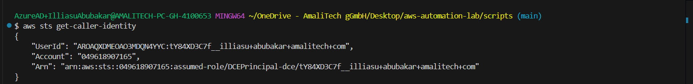
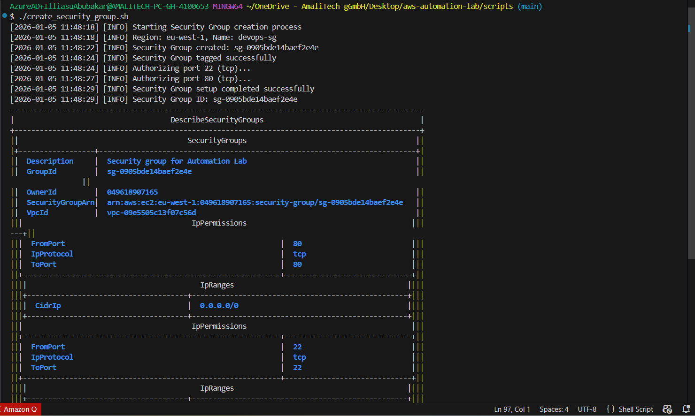
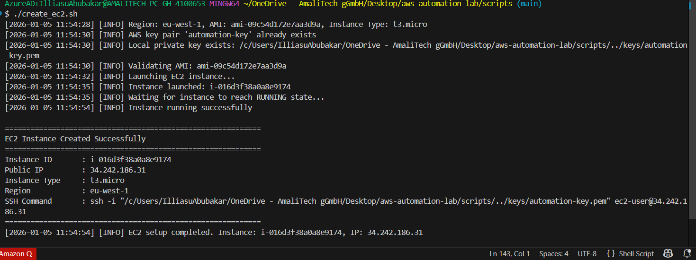
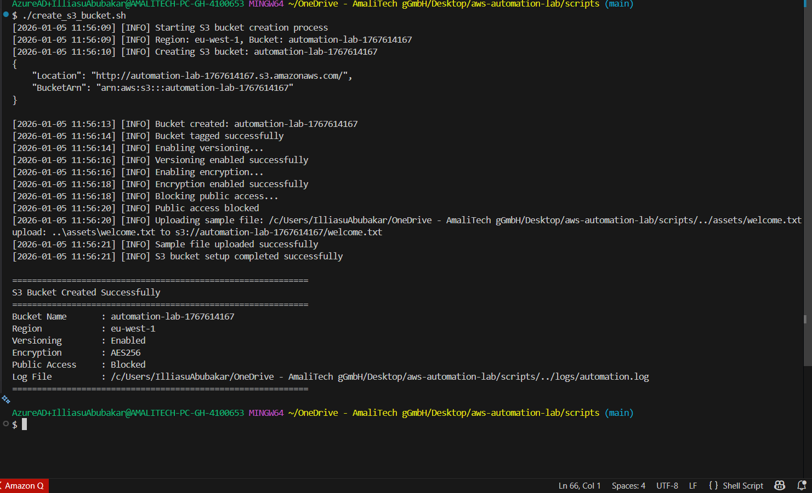
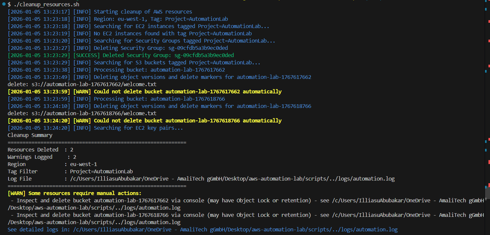

# Automate AWS Resource Creation with Bash

A small collection of Bash scripts to create and clean up basic AWS resources (EC2, Security Group, S3) using the AWS CLI.

Author: nabbi007  
Date: 2026-01-05

## Project tree
This is the recommended repository layout. Add your screenshots to `docs/screenshots/`.

```text
.
├── README.md
├── create_ec2.sh
├── create_security_group.sh
├── create_s3_bucket.sh
├── cleanup_resources.sh    # optional
└── docs
    └── screenshots
        ├── sts_identity.png
        ├── create_sg.png
        ├── create_ec2.png
        ├── create_s3.png
        └── cleanup.png
```

## Prerequisites
- Bash (Linux, macOS, or WSL)
- AWS CLI v2 installed and in PATH  
  Install: https://docs.aws.amazon.com/cli/latest/userguide/getting-started-install.html
- AWS credentials configured (via `aws configure`, named profile, or environment variables) with an IAM user/role that has EC2 and S3 permissions
- jq (optional, for parsing JSON): `sudo apt install -y jq` or `brew install jq`
- Internet access and appropriate AWS quotas (EC2, S3)

Recommended quick verification:
```bash
aws --version
aws sts get-caller-identity
aws configure list
jq --version  # optional
```

Minimal IAM actions required (grant least privilege where possible):
- EC2: Describe*, RunInstances, CreateKeyPair, CreateSecurityGroup, AuthorizeSecurityGroupIngress, TerminateInstances, DeleteKeyPair
- S3: CreateBucket, PutBucketVersioning, PutBucketPolicy, PutObject, DeleteObject, DeleteBucket

## What the scripts do (one line each)
- create_security_group.sh — create a security group and open ports 22 (SSH) and 80 (HTTP).  
- create_ec2.sh — create (or reuse) a key pair and launch a free-tier Amazon Linux 2 EC2 instance; prints instance ID and public IP.  
- create_s3_bucket.sh — create a unique S3 bucket, enable versioning, set a simple policy, upload `welcome.txt`.  
- cleanup_resources.sh — (optional) find and remove resources tagged `Project=AutomationLab` (supports `--dry-run`).

## Quick start
1. Make scripts executable:
```bash
chmod +x create_security_group.sh create_ec2.sh create_s3_bucket.sh cleanup_resources.sh
```
2. (Optional) Set AWS profile/region:
```bash
export AWS_PROFILE=default
export AWS_REGION=eu-west-1
```
3. Run scripts (examples):
```bash
./create_security_group.sh
./create_ec2.sh --key-name 
./create_s3_bucket.sh
```
4. Verify outputs printed by each script.

## Where to add screenshots
Save screenshots in `docs/screenshots/` with meaningful names. Reference them in this README using Markdown:

```markdown





```

Place the image links after the corresponding Quick start steps or in an "Example outputs" section.

## Security notes
- Do NOT hard-code AWS credentials. Use `aws configure`, environment variables, or IAM roles.
- Use least-privilege IAM policies and tag resources (`Project=AutomationLab`) so cleanup is safe.

## Want the scripts?
I can generate the example scripts with safe defaults and comments if you want — tell me and I’ll add them here.

