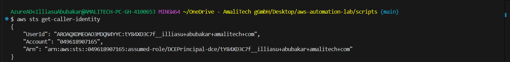
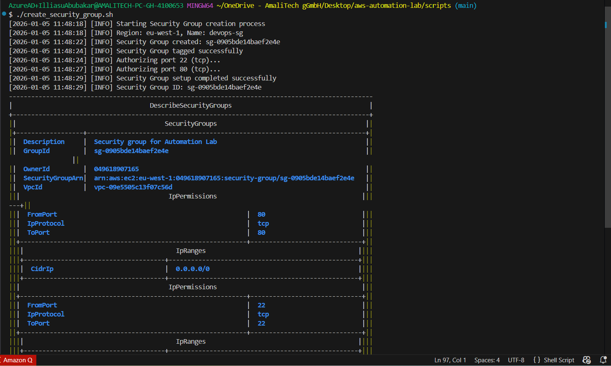
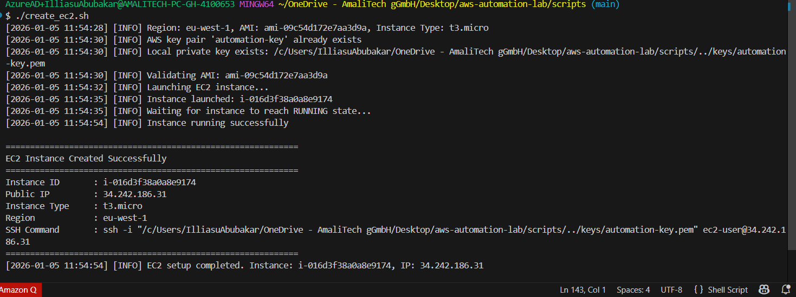
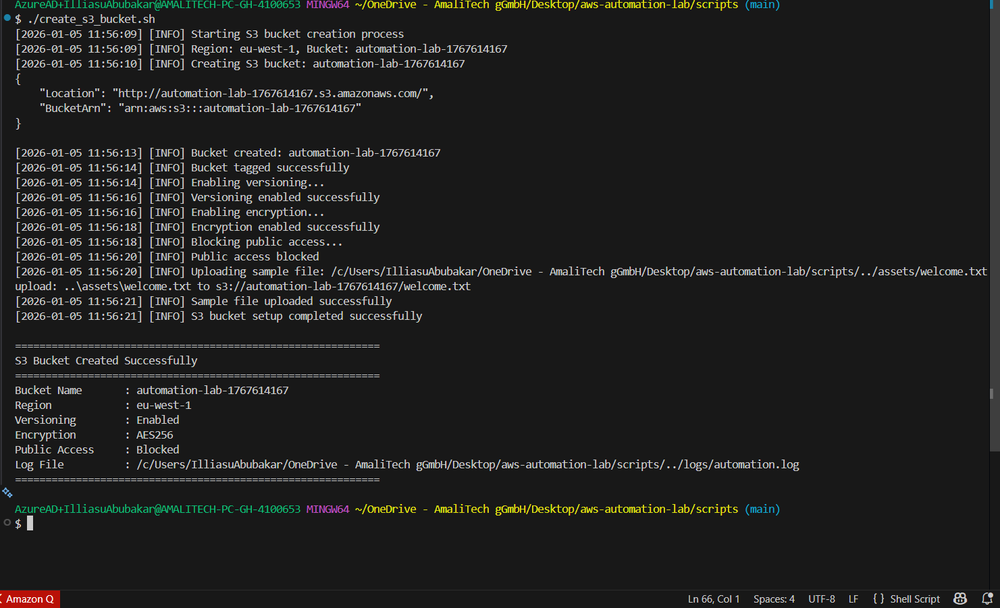
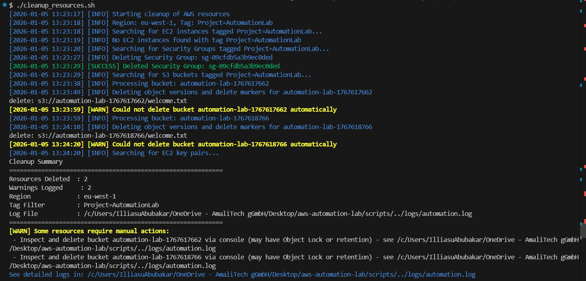

# AWS Automation Lab

Professional Bash scripts for automated AWS resource management with JSON state tracking and remote backend sync.

**Author:** nabbi007  
**Date:** January 13, 2026

## Features

✅ JSON state management (Terraform-style)  
✅ Automatic S3 remote backend with versioning  
✅ Drift detection & cleanup  
✅ Tag-based safety validation  
✅ Idempotent operations  
✅ Automatic state synchronization

## Prerequisites

**Required:**
- Bash (Linux/macOS/WSL/Git Bash)
- AWS CLI v2 ([Install](https://docs.aws.amazon.com/cli/latest/userguide/getting-started-install.html))
- jq (`sudo apt install jq` or `brew install jq`)
- Configured AWS credentials

**Verify:**
```bash
aws --version && aws sts get-caller-identity && jq --version
```

## Quick Start

### 1. Setup
```bash
cd scripts
chmod +x *.sh
export AWS_REGION=eu-west-1  # Optional, defaults to eu-west-1
```

### 2. Create Resources
```bash
# Everything automatic - state & remote backend created on first run
./create_security_group.sh
./create_ec2.sh
./create_s3_bucket.sh
```

### 3. View State
```bash
./state_manager.sh list
./state_manager.sh get ec2_instances
```

### 4. Cleanup
```bash
# Preview first (safe)
DRY_RUN=true ./cleanup_resources.sh

# Actually delete
./cleanup_resources.sh
```

## What It Does

| Script | Purpose |
|--------|---------|
| `create_security_group.sh` | Creates security group with ports 22 & 80 open |
| `create_ec2.sh` | Launches EC2 instance with key pair |
| `create_s3_bucket.sh` | Creates S3 bucket with versioning & encryption |
| `cleanup_resources.sh` | Safely deletes all tracked resources |
| `state_manager.sh` | Manages JSON state with remote sync |

## How It Works

1. **First run:** Auto-creates S3 backend bucket with unique name
2. **State tracking:** All resources automatically saved to JSON state
3. **Auto-sync:** State continuously synced to S3 (source of truth)
4. **Safety:** Tag validation + drift detection before deletion
5. **Idempotent:** Safe to run multiple times

## State Management

**Automatic Features:**
- Remote backend bucket auto-created with versioning
- State file read-only (protected from accidents)
- Drift detection (finds manually deleted resources)
- Resource locking (prevents concurrent changes)

**View Resources:**
```bash
./state_manager.sh list                # All resources
./state_manager.sh drift               # Check for drift
./state_manager.sh get security_groups # Specific type
```

## Project Structure

```
aws-automation-lab/
├── scripts/
│   ├── create_*.sh          # Resource creation
│   ├── cleanup_resources.sh # Safe cleanup
│   └── state_manager.sh     # State management
├── keys/                    # SSH keys (git-ignored)
├── logs/                    # Execution logs
└── .aws-resources.state.json # JSON state (read-only)
```

## Screenshots

### STS Identity


### Security Group Creation


### EC2 Instance


### S3 Bucket


### Cleanup


## Important Notes

⚠️ **Never hard-code AWS credentials** - use `aws configure`  
⚠️ All resources tagged with `Project=AutomationLab` for safety  
⚠️ AMI IDs vary by region - update if needed  
⚠️ State file is read-only to prevent accidental changes

## Troubleshooting

**jq not found:**
```bash
sudo apt install jq  # Ubuntu/Debian
brew install jq      # macOS
```

**State locked:**
```bash
rm -f .state.lock  # Only if no other process running
```

**View logs:**
```bash
tail -f logs/automation.log
```


